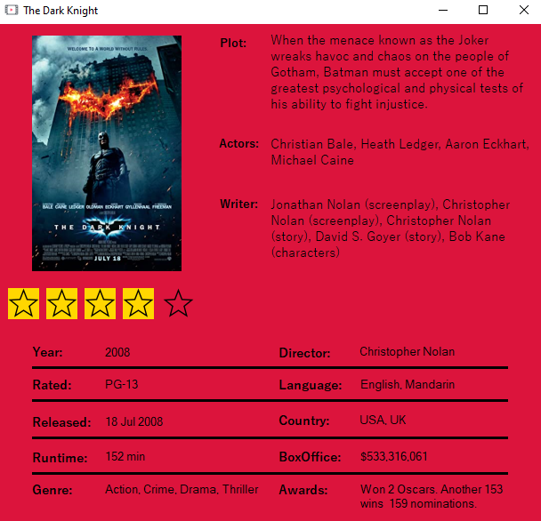

# OMDbClient
A simple Windows Form that let you search movies in the Open Movie Database (OMDb).

## Tools
* JTextBox
* [Newtonsoft](https://www.newtonsoft.com/json)

## Screenshots

*Generic research by the name of the movies.*

---

*More details about a specific movie.*

---

*Specific research by name, type and year.*

#### Developed during 2019/2020 at school.
