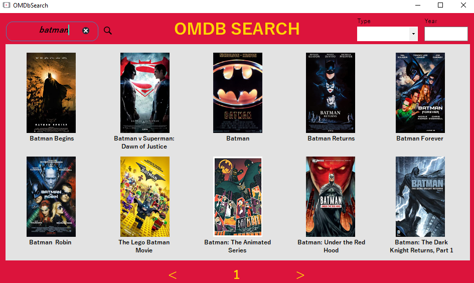

# OMDbClient
Basic Windows Form that let you search for movies in the **Open Movie Database** ([OMDb](https://www.omdbapi.com/)).

## Description
This is a client that consumes *OMDb API* and let you:
1. Search for a movie by its name (you can also use keyboard keys to change the page and to start the research);
1. Read more details about a specific element like plot, director, actors, genre, runtime, etc;
1. Set up parameters (*type* `Movie/Series/Episode/Game` and *year*) to get better results.

## Tools
* JTextBox
* [Newtonsoft](https://www.newtonsoft.com/json)

## Screenshots

*Generic research by name.*

---

*More details about a movie.*

---

*Specific research by name, type and year.*

#### Developed during 2019/2020 at school.
